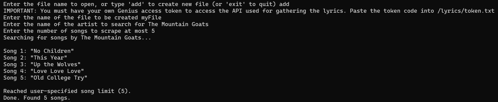
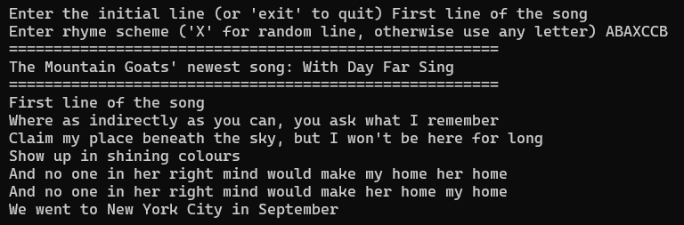

# GoatGen Rhyme Generator
 A rhyme generator with an option lyric webscraper (Genius API), written in Python.  
 Reads in a file of lyrics line by line and recombines them into a new poem, starting from an initial line written by the user.  
  
Can generate rhymes on its own or be given a rhyming scheme (I.E. ABBAB) which it will then try to follow.

# Instructions
### Installations needed
*pip install pronouncing*  
*pip install lyricsgenius*  

### Running the program
*python3 .\main.py* 

# Overview
## Webscraper
- Uses the Genius API to scrape lyrics into a file. Requires you to have your own token (See: https://docs.genius.com/)  
- Paste your token into /lyrics/token.txt
- File is saved in /lyrics/ 

## Generator  
- Reads in a file specified by the user, searching in the /lyrics/ folder  
- Add any text file you wish, just have each part separated by a newline   
- A pre-loaded lyric file called goatLyrics, containing 9000 lines of songs by The Mountain Goats, is included by default
- Has two modes: Normal and Rhyme Scheme  
### Normal Mode
- Takes an initial line from the user  
- Asks how many lines you would like it to generate  
- Searches for lines which contain end or mid rhymes, pickes a random one  
- The rhyme will naturally change to match the last word in a line, either during a mid rhyme or when it cannot find another valid rhyme  

### Rhyme Scheme Mode
Similar to normal, but this time takes in a user-specified rhyme pattern.  
- Pattern is a string of characters, where each character represents a line, and matching characters will rhyme
- 'X' is a special character and represents a totally random line

